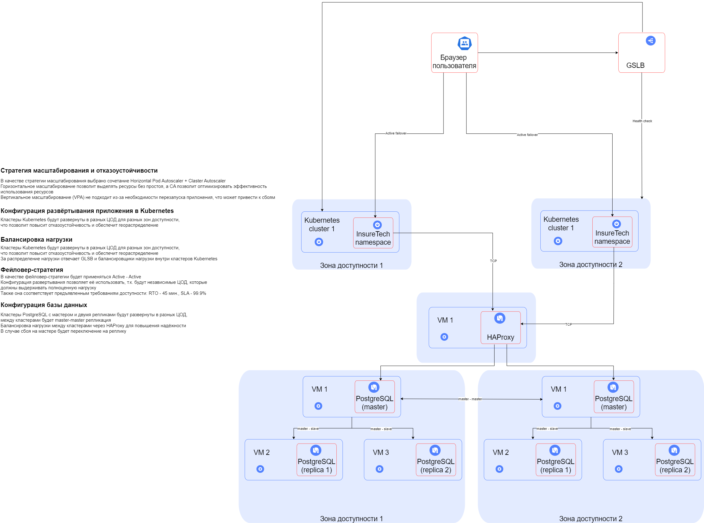
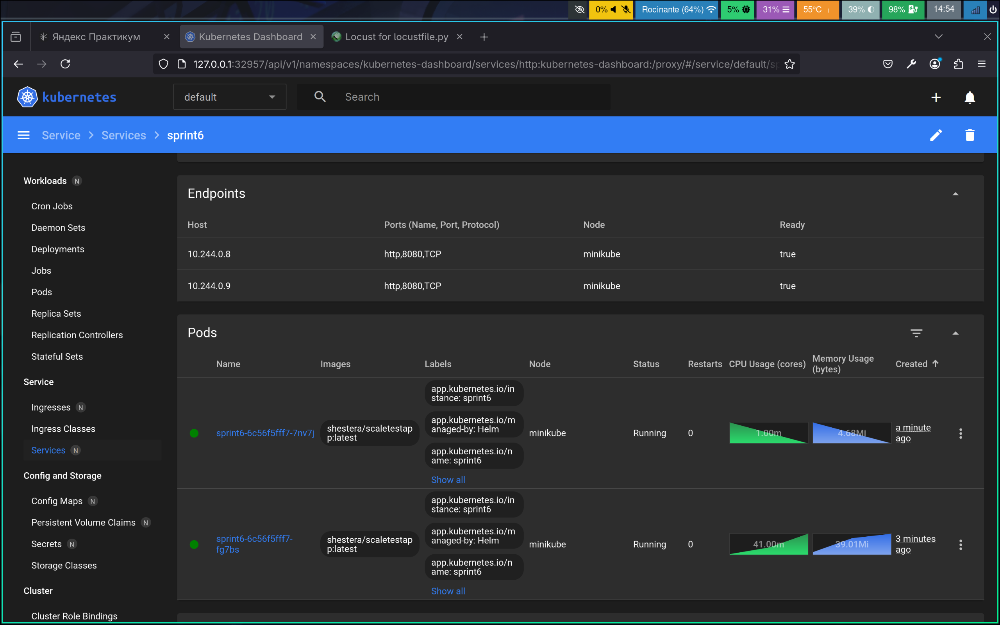
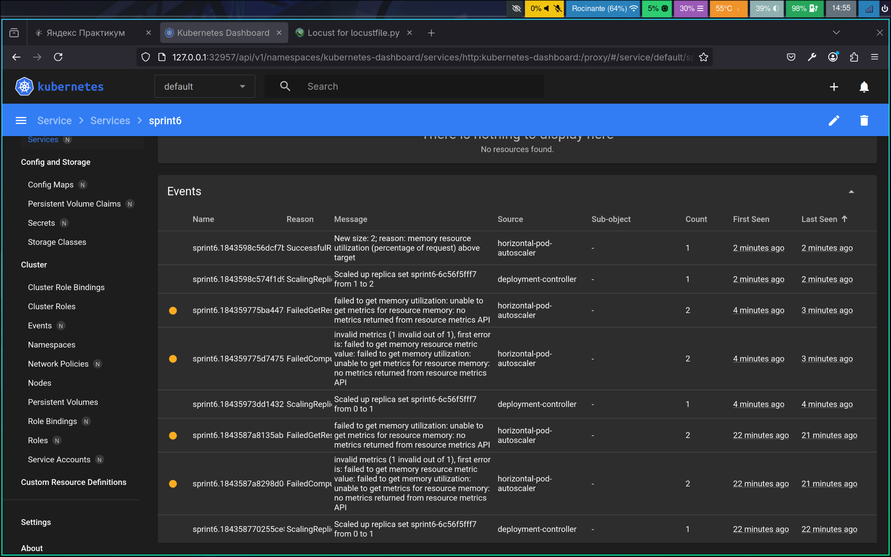
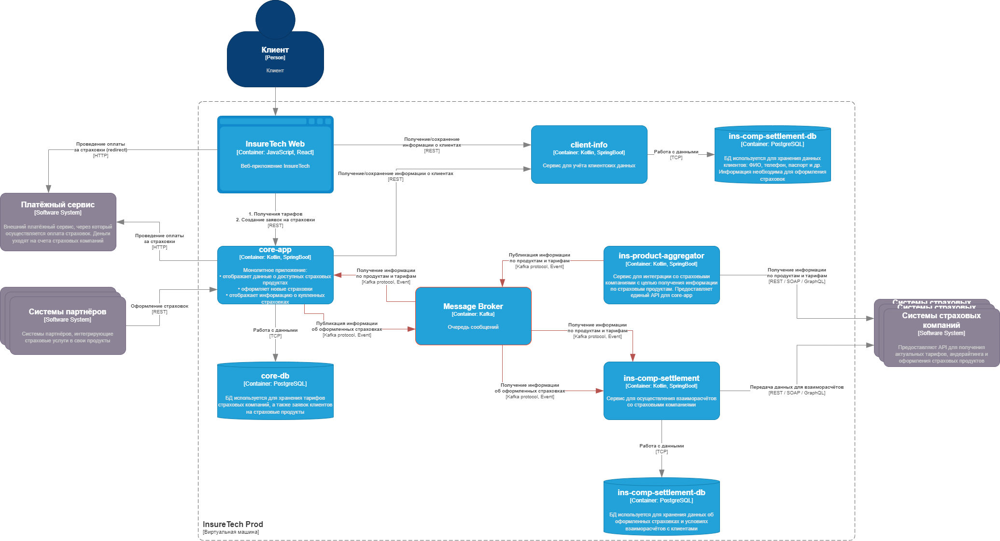
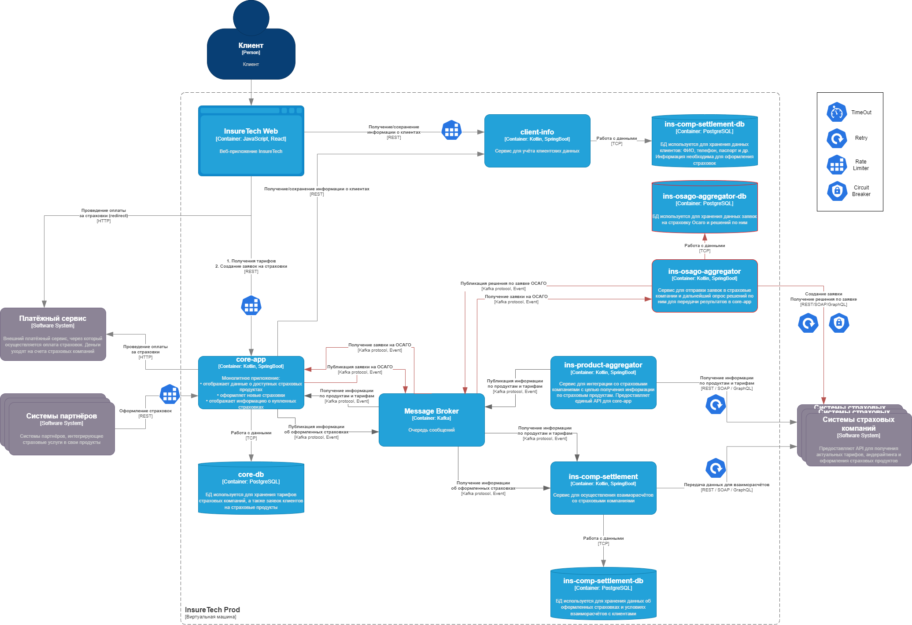

# Спринт 6
## Задание 1


## Задание 2
### Файлы
[DEPLOYMENT.YAML](./Task2/sprint6/templates/deployment.yaml)

[HPA.YAML](./Task2/sprint6/templates/hpa.yaml) берет параметы из [VALUES.YAML](./Task2/sprint6/values.yaml)

### Запуск minikube с dashboard
```
minikube start --addons=metrics-server
minikube dashboard
```
### Запуск сервиса через helm и запуск locust для нагрузочного тестирования
```
cd Task2
helm install task2 sprint6
export NODE_PORT=$(minikube kubectl -- get --namespace default -o jsonpath="{.spec.ports[0].nodePort}" services task2-sprint6)
export NODE_IP=$(minikube kubectl -- get nodes --namespace default -o jsonpath="{.items[0].status.addresses[0].address}")
echo http://$NODE_IP:$NODE_PORT
locust --host=http://$NODE_IP:$NODE_PORT -u 1500 -r 100
```
### Запуск тестирования
Запустить тестирование по адресу ```http://localhost:8089```

### Масштабирование
Под нагрузкой появится новый pod


### Логи масштабирования


### Завершение работы
```
helm uninstall task2
minikube delete
```

## Задание 3
### Проблемы и риски текущей архитектуры
1. Сервис ins-comp-settlement запрашивает данные о страховых продуктах раз в сутки, из-за чего данные могут быть
   неактуальны продолжительное время (при ошибке в запросе еще больше), что приводит к ошибкам в взаиморасчётах со
   страховыми компаниями
2. Сервис ins-product-aggregator при запросе отдаёт данные по всем страховкам сразу, что приводит к долгому выполнению
   REST-запроса и потере всех данных в случае ошибки
3. Синхронные запросы в core-app, ins-comp-settlement приводят к снижению производительность и увеличению числа ошибок
   по мере роста числа заявок


## Задание 4


## Задание 5
[Схема GraphQL](Task5/client-inf.graphql)
```
type Client {
    id: ID!
    name: String
    age: Int,
    documents: [Document!]!
    relatives: [Relative!]!
}

type Document {
    id: ID!
    type: String
    number: String
    issueDate: String
    expiryDate: String
}

type Relative {
    id: ID!
    type: String
    name: String
    age: Int
}

type Query {
    client(id: ID!): Client
}

query GetClient($id: ID!) {
    client(id: $id) {
        name
        age
    }
}

query GetClientDocuments($id: ID!) {
    client(id: $id) {
        documents {
            type,
            number,
            issueDate,
            expiryDate
        }
    }
}

query GetClientRelatives($id: ID!) {
    client(id: $id) {
        relatives {
            type,
            name,
            age
        }
    }
}
```

## Задание 6
[Конфиг NGINX с Rate Limiting](Task6/nginx.conf)
```
http {
    upstream backend_servers {
        server backend1.example.com;
        server backend2.example.com;
        server backend3.example.com;
    }

    limit_req_zone $binary_remote_addr zone=task6limit:10m rate=10r/m;

    server {
        listen 80;

        location / {
            limit_req zone=task6limit;
            limit_req_status 429;

            proxy_pass http://backend_servers;
        }
    }
}
```